<div align="center">

# 🏡 Musaned

### Empowering Productive Families Through Digital Commerce

A modern marketplace that connects productive families and home-based businesses with customers through a secure and user-friendly platform.


</div>

---

# 📖 Overview

Musaned is a digital marketplace designed to support productive families and home-based businesses by providing a centralized platform where they can showcase products, receive orders, manage sales, and reach a wider audience.

The platform simplifies the buying and selling process while helping local businesses grow through digital transformation.

---

# ✨ Features

## 👤 Customer Features

- Browse products and categories
- Search and filter products
- View detailed product information
- Place orders securely
- Track order status
- Rate and review products
- Manage profile and account settings

---

## 🏪 Productive Family Features

- Add and manage products
- Update product information
- Manage incoming orders
- Track sales performance
- Monitor business activity
- Manage business profile

---

## 🛠️ Administration Features

- User management
- Vendor verification
- Product moderation
- Order monitoring
- Complaint management
- Platform analytics

---

# 🏗️ System Architecture

The system follows a scalable architecture consisting of:

```text
Client Applications
│
├── Customer App
├── Vendor App
└── Admin Dashboard

Service Layer
│
├── Authentication
├── Product Management
├── Order Management
├── Notifications
└── Payments

Database Layer
│
├── Users
├── Products
├── Orders
└── Analytics
```

---

# 📱 Screenshots

<div align="center">

| | | |
|:-:|:-:|:-:|
| 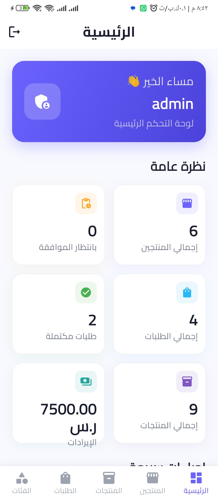 | 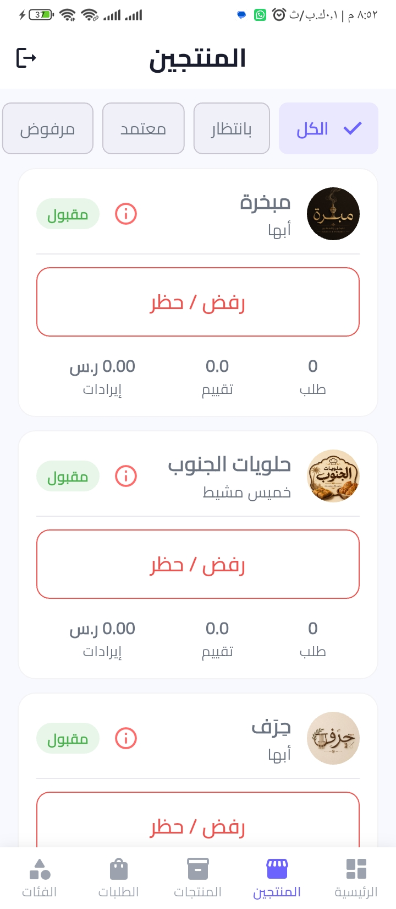 | 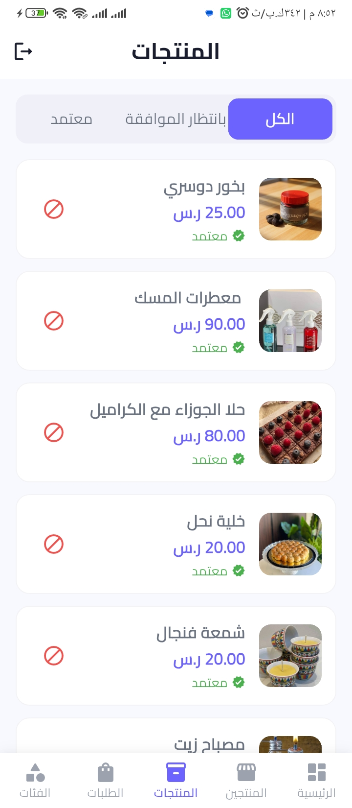 |
| 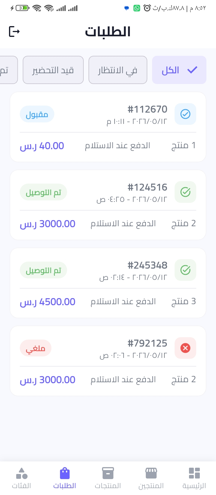 | 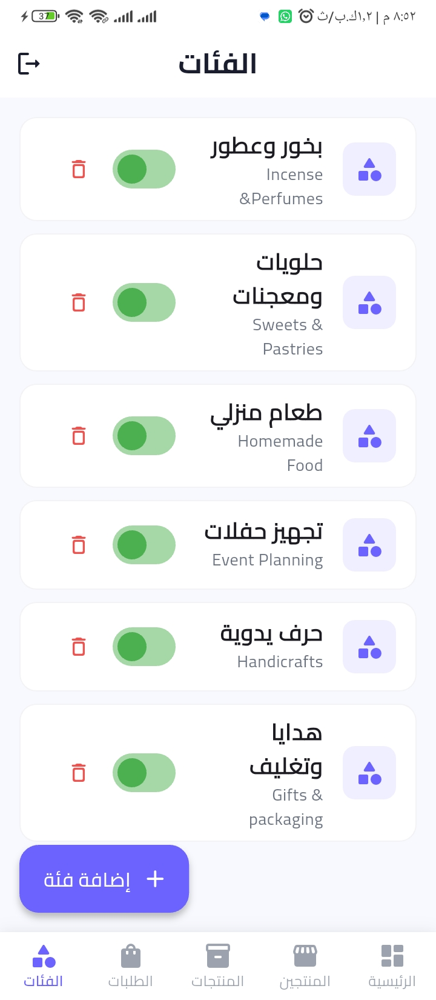 | 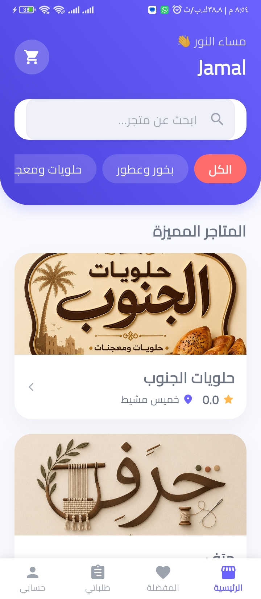 |
| 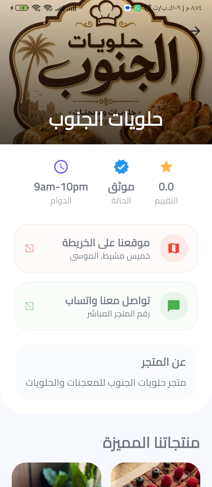 | 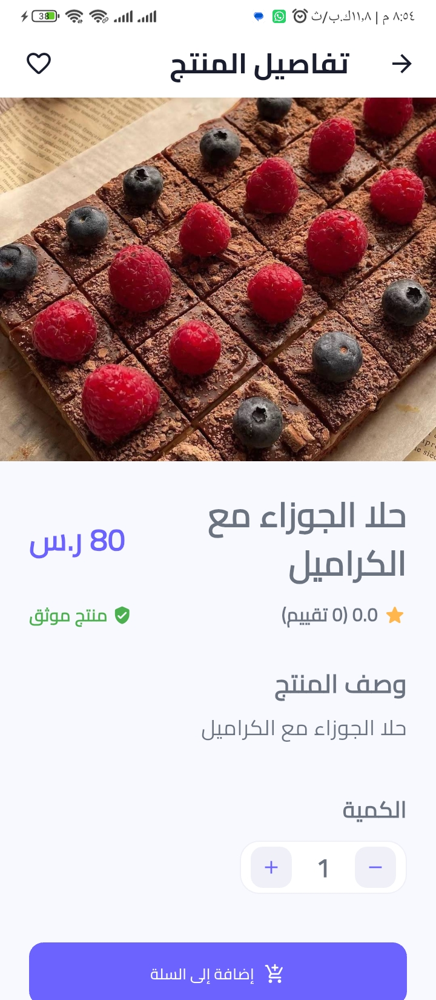 | 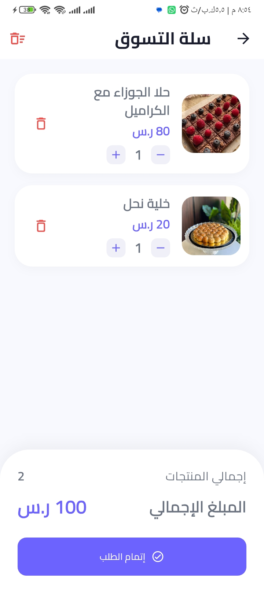 |
| 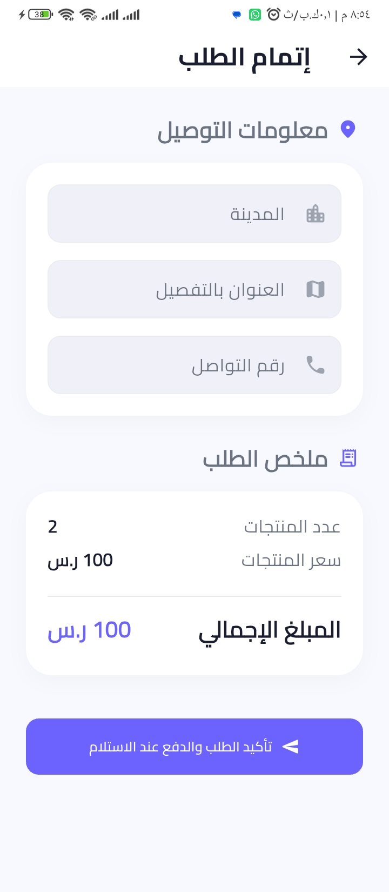 |  | 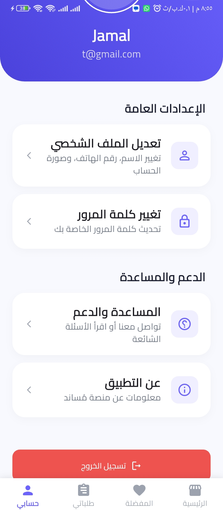 |
| 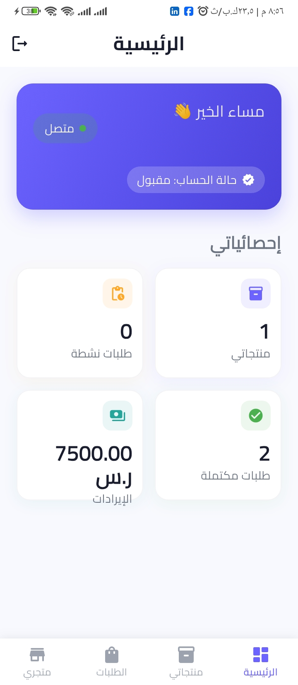 | 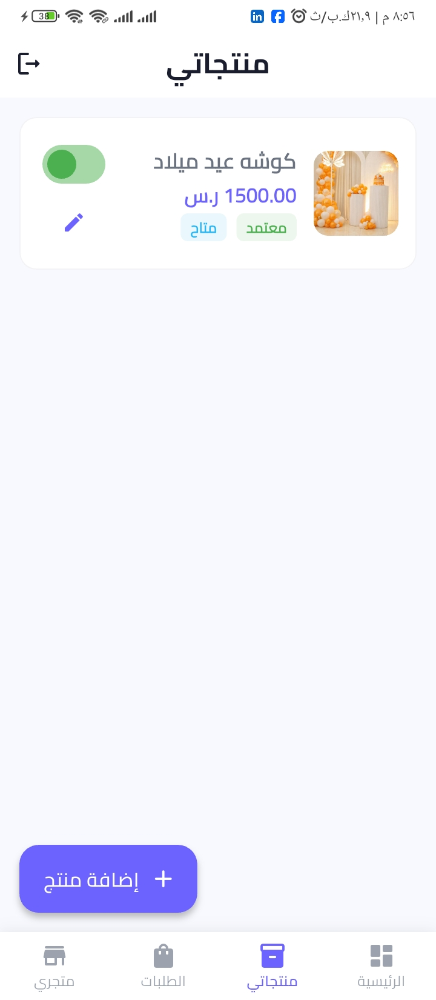 |  |

</div>

# ⚙️ Technologies Used

- Flutter
- Dart
- Firebase Authentication
- Cloud Firestore
- Firebase Storage
- Firebase Cloud Messaging (FCM)
- REST APIs

---

# 📂 Project Structure

```text
lib/
├── models/
├── services/
├── repositories/
├── providers/
├── pages/
├── widgets/
├── utils/
└── main.dart
```

---

# 🚀 Getting Started

## Clone Repository

```bash
git clone https://github.com/your-username/musaned.git
```

## Open Project

```bash
cd musaned
```

## Install Dependencies

```bash
flutter pub get
```

## Run Application

```bash
flutter run
```

---

# 🔥 Firebase Configuration

1. Create a Firebase project.
2. Add Android application.
3. Download `google-services.json`.
4. Place the file inside:

```text
android/app/
```

5. Enable:

- Authentication
- Cloud Firestore
- Firebase Storage
- Cloud Messaging

---

# 🎯 Project Goals

- Support productive families.
- Increase digital market access.
- Simplify product management.
- Improve customer experience.
- Enhance local commerce.

---

# 📈 Future Plans

- Multi-language support
- Additional payment gateways
- Enhanced delivery integration
- Advanced reporting dashboard
- Business performance insights

---

# 📄 License

This project is available for educational and portfolio purposes.

---

<div align="center">

Made with ❤️ using Flutter & Firebase

</div>
